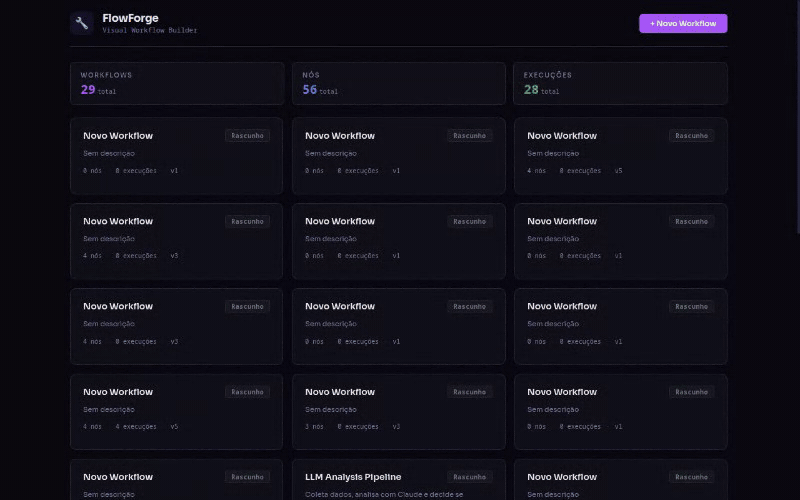
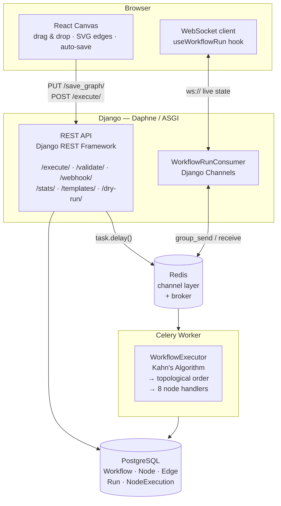
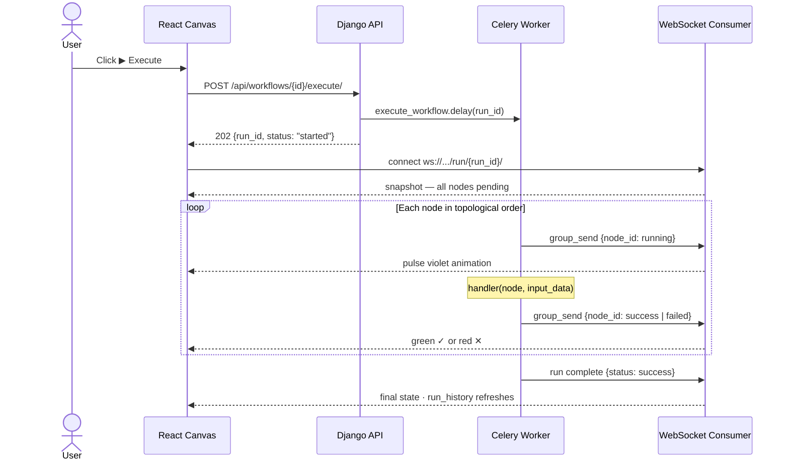
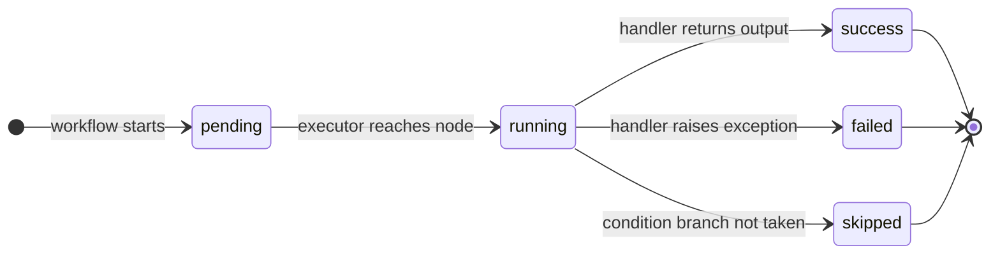
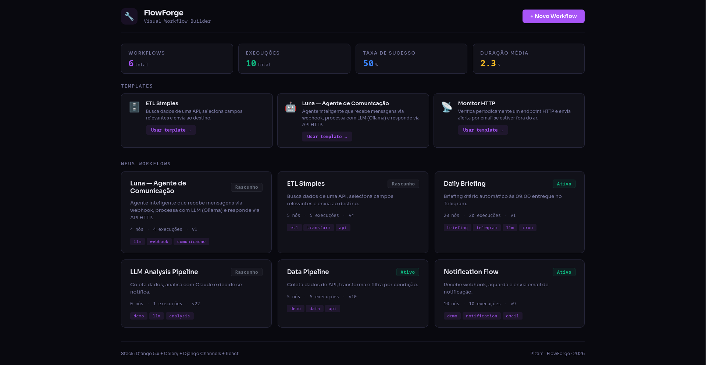
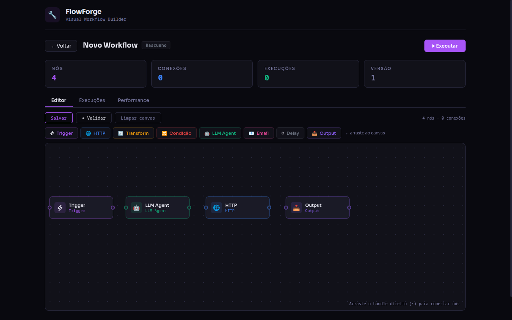
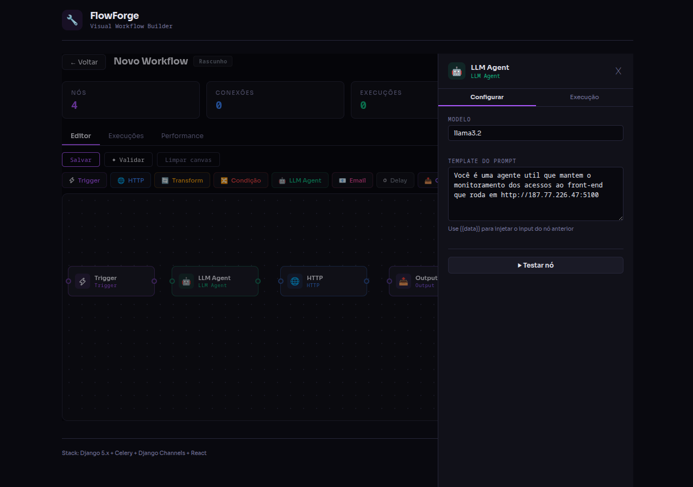
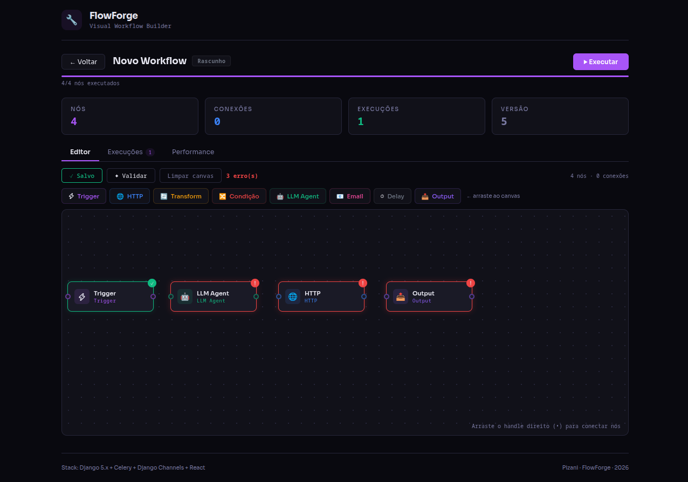
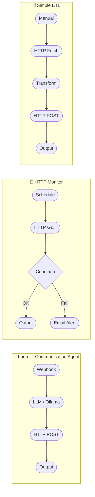
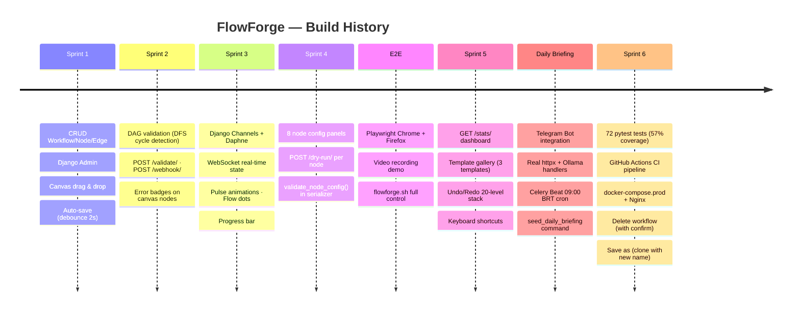

<div align="center">

    ███████╗██╗      ██████╗ ██╗    ██╗███████╗ ██████╗ ██████╗  ██████╗ ███████╗
    ██╔════╝██║     ██╔═══██╗██║    ██║██╔════╝██╔═══██╗██╔══██╗██╔════╝ ██╔════╝
    █████╗  ██║     ██║   ██║██║ █╗ ██║█████╗  ██║   ██║██████╔╝██║  ███╗█████╗
    ██╔══╝  ██║     ██║   ██║██║███╗██║██╔══╝  ██║   ██║██╔══██╗██║   ██║██╔══╝
    ██║     ███████╗╚██████╔╝╚███╔███╔╝██║     ╚██████╔╝██║  ██║╚██████╔╝███████╗
    ╚═╝     ╚══════╝ ╚═════╝  ╚══╝╚══╝ ╚═╝      ╚═════╝ ╚═╝  ╚═╝ ╚═════╝ ╚══════╝                   

**Visual workflow builder · Real-time execution via WebSocket · LLM-powered agents**

[](https://djangoproject.com)
[](https://react.dev)
[](https://docs.celeryq.dev)
[](https://channels.readthedocs.io)
[](https://playwright.dev)
[](https://docs.docker.com/compose)

</div>

---

## Demo



> *Creating a Webhook → LLM (Luna/Ollama) → HTTP → Output pipeline from scratch, configuring each node, and executing with real-time WebSocket feedback — recorded at 2× speed.*

---

## What is FlowForge?

FlowForge is a full-stack automation platform where you build workflows visually — drag nodes onto a canvas, wire them together, and watch them execute in real time with WebSocket-driven animations.

Every node type has a dedicated configuration panel. Every run is logged with per-node input/output and duration. Every execution step pushes state to the canvas live.

Think **n8n meets a custom Python backend** — built from scratch to demonstrate full-stack engineering depth.

---

## Architecture



---

## Execution Flow



---

## Node State Machine



---

## Screenshots


<table>
<tr>
<td width="50%">

**Dashboard & Template Gallery**



</td>
<td width="50%">

**Canvas Editor**



</td>
</tr>
<tr>
<td width="50%">

**Node Configuration Panel (LLM)**



</td>
<td width="50%">

**Real-time Execution Feedback**



</td>
</tr>
</table>
---

## Node Types


| Icon | Type        | Function                  | Key Config                                            |
| ---- | ----------- | ------------------------- | ----------------------------------------------------- |
| ⚡   | `trigger`   | Workflow entry point      | `trigger_type`: manual \| webhook \| schedule (cron)  |
| 🌐   | `http`      | Real HTTP request (httpx) | method, url, headers (key-value editor), body         |
| ⚙️ | `transform` | Data manipulation         | operation: pick\| rename \| merge \| map \| flatten   |
| 🔀   | `condition` | If/else branch            | field, operator (8 ops), value →`true`/`false` edges |
| 🤖   | `llm`       | LLM via Ollama (real)     | model, prompt_template (with`{{data}}` interpolation) |
| 📧   | `email`     | SMTP email                | to, subject, body_template                            |
| ⏱️ | `delay`     | Pause execution           | seconds (slider 1–60 + numeric input)                |
| 📤   | `output`    | Terminal node             | format: raw\| summary                                 |
| ✈️ | `telegram`  | Telegram Bot message      | text template, parse_mode, optional chat_id override  |

Each node has a **configuration panel** with form validation and a **dry-run** button to test it in isolation — without touching the database or starting a full run.

---

## Template Gallery

Three production-ready templates, available from the dashboard:



Click **"Usar template →"** on the dashboard to instantiate any template as a new editable workflow.

---

## Canvas Features


| Feature                | Detail                                                                   |
| ---------------------- |--------------------------------------------------------------------------|
| Drag & drop            | Palette items → canvas at exact drop position                            |
| Edge drawing           | Drag right handle (•) from source to target node                         |
| Auto-save              | Debounce 2s after every canvas mutation                                  |
| Validation             | DAG check: cycle detection (DFS white/gray/black) + unreachable nodes    |
| **Undo / Redo**        | 20-level history stack · ↩ ↪ buttons ·`Ctrl+Z` / `Ctrl+Y`                |
| **Keyboard shortcuts** | `Ctrl+S` save · `Delete` remove selected · `Ctrl+Z` undo · `Ctrl+Y` redo |
| Node errors            | Red border +`!` badge with message on hover                              |
| Execution state        | Violet pulse → green ✓ / red ✕ (all via WebSocket)                       |
| Flow dots              | SVG`animateMotion` dots travel along active edges                        |
| Progress bar           | Live`completed/total` counter during execution                           |
| Dry-run                | Test any node in isolation with custom input data                        |
| **Save as**            | Clone workflow with a new name via prompt                                |
| **Delete workflow**    | Permanently delete with confirmation dialog                              |

---

## Quick Start

```bash
git clone <repo> && cd flowforge
./flowforge.sh start          # Docker Compose up + health checks for backend + frontend

# Seed demo data
docker compose exec backend python manage.py seed_workflows        # 3 demo workflows
docker compose exec backend python manage.py seed_templates        # 3 gallery templates
docker compose exec backend python manage.py seed_daily_briefing   # Daily Briefing + cron 09:00 BRT

# Services:
#   UI:        http://localhost:5106
#   API:       http://localhost:8006/api/
#   Admin:     http://localhost:8006/admin/
#   WebSocket: ws://localhost:8006/ws/
```

### Trigger a workflow externally (no browser needed)

```bash
curl -X POST http://localhost:8006/api/workflows/{id}/webhook/ \
  -H "Content-Type: application/json" \
  -d '{"message": "Hello!", "from": "5511999999999"}'
# → {"run_id": "...", "status": "execução iniciada"}
```

---

## API Reference

```
# Workflows
GET    /api/workflows/                          List all workflows
POST   /api/workflows/                          Create workflow
GET    /api/workflows/stats/                    {total_runs, success_rate, avg_duration_ms, node_type_counts}
GET    /api/workflows/templates/                Template gallery
POST   /api/workflows/from-template/{slug}/    Instantiate template as workflow
PUT    /api/workflows/{id}/save_graph/          Atomic save (nodes + edges)
POST   /api/workflows/{id}/execute/             Execute via Celery
POST   /api/workflows/{id}/validate/            {valid, errors: [{node_id, message}]}
POST   /api/workflows/{id}/webhook/             External HTTP trigger
POST   /api/workflows/{id}/duplicate/           Clone with all nodes + edges

# Nodes
GET    /api/nodes/{id}/
POST   /api/nodes/{id}/dry_run/                {output_data, error, duration_ms}

# Runs
GET    /api/runs/?workflow={id}                 List runs
GET    /api/runs/{id}/                          Full detail with per-node executions
POST   /api/runs/{id}/cancel/                   Cancel in-flight run

# WebSocket
WS     /ws/workflow/{id}/run/{run_id}/          Live execution stream (replays snapshot on connect)
```

---

## Tech Stack


| Layer       | Technology                          | Role                                              |
| ----------- | ----------------------------------- | ------------------------------------------------- |
| Backend     | Django 5.x + Django REST Framework  | ORM, serializers, ViewSets, validation            |
| Async tasks | Celery + Redis                      | Decoupled execution, retry logic                  |
| Real-time   | Django Channels + Daphne (ASGI)     | WebSocket — zero polling                         |
| Database    | PostgreSQL                          | JSONB for node config, run output                 |
| LLM         | Ollama (local)                      | Self-hosted models — no API key needed           |
| Frontend    | React 18                            | Functional components, hooks, no framework        |
| Charts      | Recharts                            | SVG-based stats charts                            |
| Styling     | CSS-in-JS inline                    | Zero build config, design tokens via`var(--*)`    |
| Unit tests  | pytest + pytest-django              | 72 tests, 57% coverage — models/API/engine/tasks |
| E2E tests   | Playwright (Chrome + Firefox)       | Video recording, trace viewer                     |
| Containers  | Docker Compose (dev) + Nginx (prod) | One-command local stack · prod-ready config      |

---

## E2E Tests & Demo Recording

```bash
./flowforge.sh test          # Headed — Chrome + Firefox (watch live)
./flowforge.sh test:ci       # Headless (CI/CD)
./flowforge.sh demo          # Records Luna workflow → test-results/*/video.webm
./flowforge.sh trace         # Opens Playwright Trace Viewer
./flowforge.sh report        # Opens HTML test report
./flowforge.sh codegen       # Record new tests by interacting with the browser
./flowforge.sh ui            # Playwright UI Mode (interactive)
```

The demo spec (`e2e/demo.spec.js`) creates a complete 4-node workflow from scratch, configures each node via its panel, validates the DAG, executes, and captures the full run history — all in ~34 seconds of real time.

---

## Project Structure

```
flowforge/
├── backend/
│   ├── config/                   # Django settings, ASGI, URLs
│   └── flowforge/
│       ├── models.py             # Workflow, Node, Edge, Run, NodeExecution, WorkflowTemplate
│       ├── engine/
│       │   ├── dag_engine.py     # validate_dag() — DFS cycle detection + unreachable nodes
│       │   ├── executor.py       # WorkflowExecutor — Kahn's Algorithm
│       │   └── handlers.py       # 9 node handlers (strategy pattern) — http/llm/telegram are real
│       ├── api/
│       │   ├── serializers.py    # validate_node_config() per node type
│       │   └── views.py          # ViewSets + @actions (execute, validate, stats, templates...)
│       ├── consumers.py          # WorkflowRunConsumer (WebSocket + snapshot replay)
│       ├── tasks.py              # execute_workflow + trigger_daily_briefing Celery tasks
│       └── management/commands/
│           ├── seed_workflows.py
│           ├── seed_templates.py
│           └── seed_daily_briefing.py  # Daily Briefing workflow + CeleryBeat PeriodicTask
├── frontend/
│   └── src/
│       ├── App.jsx               # Canvas editor + all views
│       ├── components/
│       │   ├── NodeConfigPanels.jsx    # 9 config panels (one per node type, incl. Telegram)
│       │   └── NodeDetailDrawer.jsx   # Configure / Execution tabs + inline dry-run
│       ├── hooks/
│       │   ├── useApi.js               # Generic fetch hook with loading/error state
│       │   └── useWorkflowRun.js       # WebSocket + execution state machine
│       └── utils/formatters.js         # NODE_TYPES, RUN_STATUS, WORKFLOW_STATUS
│   └── e2e/
│       ├── demo.spec.js                # Portfolio demo — full Luna workflow
│       ├── 01-workflow-list.spec.js
│       ├── 02-create-workflow.spec.js
│       ├── 03-canvas-nodes.spec.js
│       └── 04-execute-workflow.spec.js
├── backend/
│   ├── tests/
│   │   ├── conftest.py               # Shared fixtures (workflow, workflow_with_nodes, template)
│   │   ├── test_models.py            # 17 tests — Workflow, Node, Edge, Run, WorkflowTemplate
│   │   ├── test_dag_engine.py        # 11 tests — cycle detection, unreachable nodes
│   │   ├── test_serializers.py       # 17 tests — validate_node_config, NodeSerializer, EdgeSerializer
│   │   ├── test_api.py               # 23 tests — all REST endpoints + dry_run + cancel
│   │   └── test_tasks.py             #  4 tests — execute_workflow, trigger_daily_briefing
│   ├── pytest.ini                    # DJANGO_SETTINGS_MODULE + asyncio_mode
│   └── requirements-dev.txt          # pytest-django, pytest-mock, pytest-cov, pytest-asyncio
├── nginx/nginx.conf              # Reverse proxy: API + WebSocket upgrade + static files
├── docs/assets/                  # Screenshots + demo GIF
├── flowforge.sh                  # Stack control + demo recording
├── docker-compose.yml            # Development stack
└── docker-compose.prod.yml       # Production: + Postgres + Nginx + healthchecks
```

---

## Design System

```
Colors
  --bg:       #09090f    page background
  --surface:  #111119    card / panel background
  --surface2: #1a1a26    elevated elements
  --border:   #26263a    borders and dividers
  --fg:       #e6e6f0    primary text
  --muted:    #7878a0    secondary text
  --accent:   #a855f7    violet — primary action / running state
  --success:  #10b981    green — success state
  --warning:  #fbbf24    yellow — warnings / avg duration metric
  --danger:   #ef4444    red — failed state / validation errors
  --info:     #3b82f6    blue — informational metrics

Typography
  body:  Sora (system-ui fallback)
  code:  Cascadia Code → Fira Code → SF Mono → monospace
```

---

## Sprint History



---

<div align="center">

Built with Python + React &nbsp;·&nbsp; Dark mode only &nbsp;·&nbsp; No magic — just code

</div>
